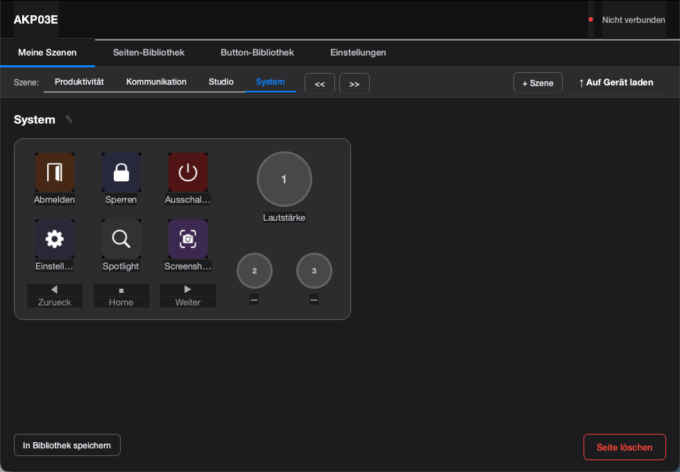
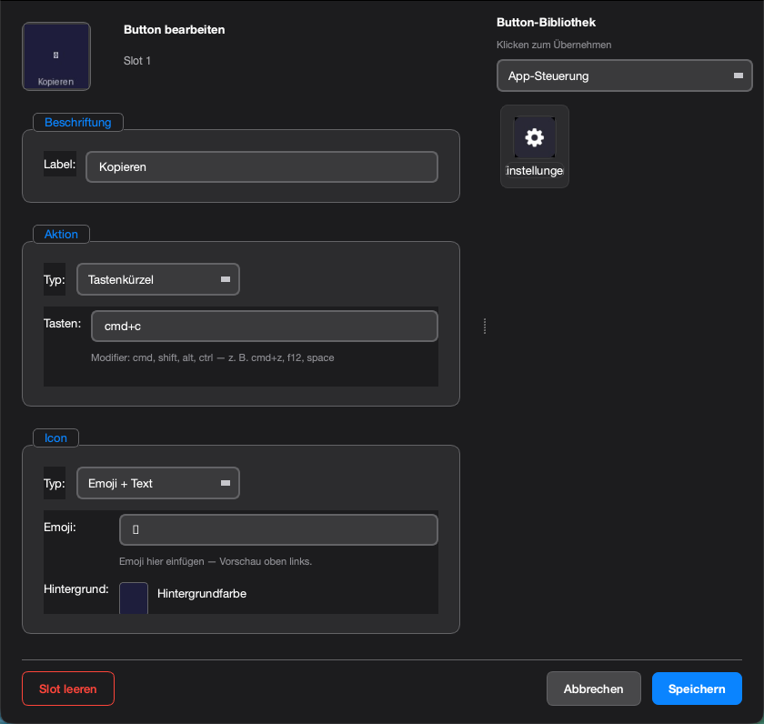
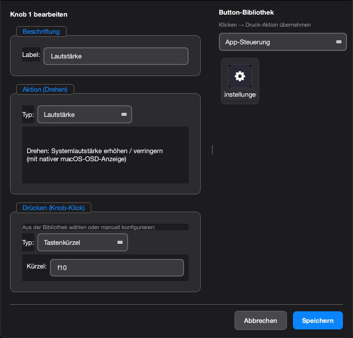

# DeckPad

A macOS menu-bar app for the **AJAZZ AKP03E** macro pad (and compatible Mirabox Stream Dock devices).  
Configure buttons, knobs and navigation keys with shortcuts, app launchers, URLs and shell commands — all without touching a terminal.

---

## Screenshots

**Konfigurationsfenster** — Szenen, Buttons und Knobs auf einen Blick:



**Button-Editor** — Aktion, Icon und Label konfigurieren (mit Button-Bibliothek rechts):



**Knob-Editor** — Dreh- und Drück-Aktion unabhängig konfigurieren:



---

## Features

- **6 configurable buttons** per scene — assign shortcuts, launch apps, open URLs or run shell commands
- **3 rotary knobs** — turn actions (volume, brightness, scroll, custom shortcuts) + press actions
- **Multiple scenes** — switch between layouts with the hardware navigation keys (Prev / Home / Next)
- **Button & page library** — built-in categories (media, system, productivity) + custom buttons you save yourself
- **Menu-bar only** — no Dock icon, runs silently in the background
- **Live event log** — real-time debug window showing every HID event → action trace
- **Auto-reconnect** — detects plug/unplug and reconnects automatically
- **macOS Launch Agent** — optional autostart at login

---

## Supported Devices

| Device | VID | PID | Status |
|--------|-----|-----|--------|
| AJAZZ AKP03E | `0x1915` | `0xEEEE` | Fully supported |
| Mirabox Stream Dock (same firmware) | `0x1915` | `0xEEEE` | Should work |

The HID protocol was reverse-engineered from USB captures. Other Mirabox variants with different VID/PID may need small adjustments in `akp03e.py`.

---

## Requirements

- **macOS 13 Ventura or later** (Apple Silicon and Intel)
- Python 3.11+

```
pip install -r requirements.txt          # hidapi, Pillow, PySide6
pip install -r requirements-macos.txt   # pyobjc (AppKit, Quartz)
```

---

## Installation

### Option A — Run from source

```bash
git clone https://github.com/johannesluschow/DeckPad.git
cd DeckPad
python3 -m venv .venv
source .venv/bin/activate
pip install -r requirements.txt
pip install -r requirements-macos.txt
python3 app_main.py
```

### Option B — Build a standalone .app

```bash
pip install pyinstaller
python3 create_app_icon.py   # generates assets/DeckPad.icns
pyinstaller DeckPad.spec
# -> dist/DeckPad.app  (~120 MB, fully self-contained)
```

Install to `/Applications` — always remove the old version first:

```bash
rm -rf /Applications/DeckPad.app
cp -R dist/DeckPad.app /Applications/
```

> **Note:** Using `cp -R` without removing the old app first merges the directories instead of replacing them — the old binary stays in place.

After installing, grant **Accessibility** access (see [Permissions](#permissions) below).

---

## Usage

After launching, **DeckPad** appears in the macOS menu bar.

| Menu item | Action |
|-----------|--------|
| Click the icon | Open context menu |
| **Einstellungen…** | Open the configuration window |
| **Szene:** | Shows the currently active scene |
| **Ereignis-Log…** | Open the real-time debug log |
| **Autostart** | Toggle launch-at-login |
| **Beenden** | Quit DeckPad |

### Configuration window

- **Scenes** — add, rename, reorder or delete scenes using the toolbar on the left
- **Buttons** — double-click any button tile to open the button editor; choose an action type, icon and label
- **Knobs** — double-click a knob to set turn and press actions
- **Library** — drag or click a library button to apply it instantly

### Hardware navigation

The three small navigation buttons on the device (◀ Home ▶) switch between scenes by default.  
You can override each nav button with any action from the button editor.

---

## Project Structure

```
app_main.py          # Entry point (QApplication first, then all imports)
app/
  menu_bar.py        # Menu-bar icon, context menu, signal routing
  config_window.py   # Main configuration window
  button_editor.py   # Button + knob editor dialogs
  library_panel.py   # Reusable library panel widget
  hid_thread.py      # HID polling (main-thread, IOKit-safe)
  scene_widget.py    # Visual scene preview widget
  log_window.py      # Real-time event log dialog
  styles.py          # Global dark stylesheet
config/
  config_manager.py  # Load/save config.json + button/page library
data/
  library/
    buttons.json     # Built-in button library (bundled, read-only)
    pages/           # User-saved page library (writable)
assets/
  DeckPad.icns       # App icon
  icons/             # SF-Symbol-style PNG icons for library buttons
akp03e.py            # HID protocol driver (AKP03E)
actions.py           # Action executors (shortcuts, app launch, URL, shell)
icons.py             # Icon rendering with Pillow
log_sink.py          # Thread-safe log signal emitter
autostart.py         # macOS Launch Agent helper
DeckPad.spec         # PyInstaller build spec
```

User data (config, custom library) is stored in:  
`~/Library/Application Support/DeckPad/`

---

## macOS Notes

### Permissions

DeckPad needs **Accessibility** access to send keyboard shortcuts, scroll events and other synthetic input:

> **System Settings → Privacy & Security → Accessibility → add DeckPad**

When running from source (`python3 app_main.py`) the Terminal or Python binary needs this permission instead.

DeckPad will show a warning dialog on first launch if Accessibility access is missing, with a button to open System Settings directly.

> **After every reinstall:** macOS ties the Accessibility grant to the app's code signature. Replacing the `.app` bundle (even to the same path) creates a new identity — the old grant is silently revoked.  
> **After each reinstall you must:**  
> 1. Open System Settings → Privacy & Security → Accessibility  
> 2. Remove DeckPad from the list (`−`)  
> 3. Add it again (`+` → `/Applications/DeckPad.app`)  
> 4. Restart DeckPad

### HID access

On macOS, HID devices are accessible without special entitlements as long as the VID/PID matches a non-protected usage page. The AKP03E uses usage page `0xFF00` (vendor-defined), which is always accessible.

---

## Known Limitations

- **macOS only** — Windows support was prototyped but is not actively maintained  
- The `.app` bundle is not notarized; macOS Gatekeeper will warn on first launch (right-click → Open to bypass)
- App icons on buttons require an absolute path to a `.app` bundle

---

## Contributing

Bug reports and pull requests are welcome!

1. Fork the repository
2. Create a feature branch: `git checkout -b feature/my-feature`
3. Commit your changes
4. Open a pull request

Please keep commits focused and include a short description of the motivation.

---

## License

MIT — see [LICENSE](LICENSE).
